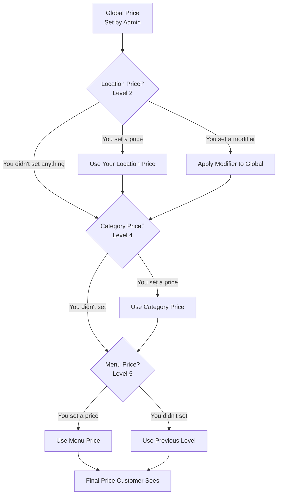
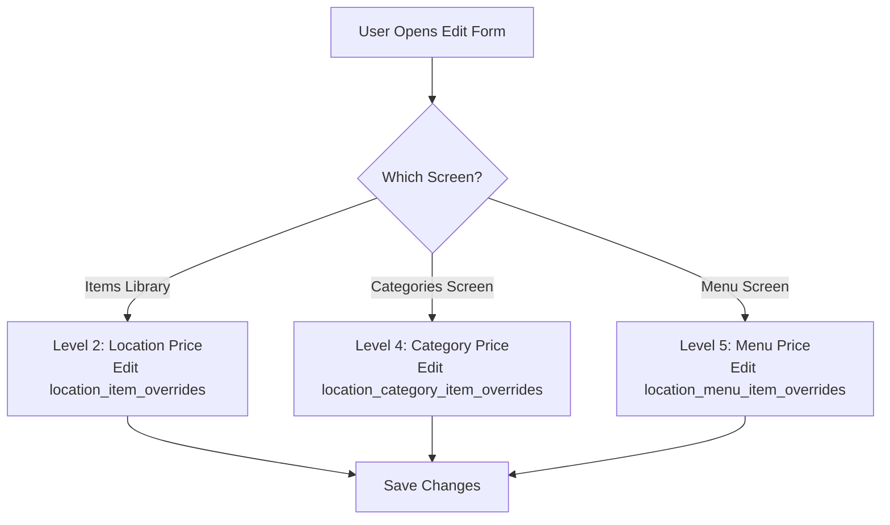
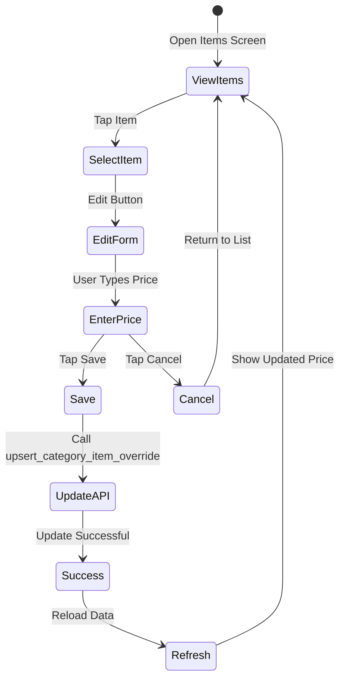

# React Native POS Menu Management Guide
## For Location Managers on POS Tablets

## Table of Contents
1. [What Is This System?](#what-is-this-system)
2. [The 3 Levels You Can Edit](#the-3-levels-you-can-edit)
3. [How Prices Work](#how-prices-work)
4. [What You Can Do](#what-you-can-do)
5. [How to Implement](#how-to-implement)
6. [Common Tasks](#common-tasks)

---

## What Is This System?

When you're managing your menu on a POS tablet, you can set different prices for items in three different ways:

1. **Location-Wide Price** - Change the price for an item at your entire location (applies to all menus and categories)
2. **Category Price** - Change the price for an item within a specific category at your location (like "Happy Hour" or "Breakfast")
3. **Menu Price** - Change the price for an item in a specific menu within a category (like "Breakfast Menu" in the "Breakfast" category)

The system automatically figures out which price to use. Think of it like layers - the most specific price wins. If you set a menu price, that's what customers see. If you don't set a menu price, it checks the category price. If there's no category price, it uses your location price. And if you haven't set any of those, it uses the global price set by the merchant admin.

---

## The 3 Levels You Can Edit

### Level 2: Location-Wide Pricing
**What it is**: A price that applies to an item at your entire location, no matter which menu or category it's in.

**When you see this**: When you're viewing the "Items Library" screen and editing an item without being in a specific category or menu.

**What you can change**:
- Price (fixed amount)
- Cash price (if different)
- Add a markup (like "+$2.00" or "+10%")
- Availability (turn item on/off at your location)
- Stock tracking

**Example**: You're at an airport location and want to add $2 to all items because of higher costs. You'd set a location-wide price modifier.

### Level 4: Location + Category Pricing
**What it is**: A price that applies to an item only when it's in a specific category at your location.

**When you see this**: When you're viewing items within a category (like "Happy Hour" or "Breakfast") and editing an item.

**What you can change**:
- Price for this category
- Cash price for this category
- Availability in this category
- Display order (where it appears in the category)
- Featured status (highlight this item)

**Example**: You want "Happy Hour" items to be $5 at your location, but other locations might have different happy hour prices. You'd set a category price.

### Level 5: Location + Menu + Category Pricing
**What it is**: A price that applies to an item only when it's in a specific menu, within a specific category, at your location.

**When you see this**: When you're viewing a menu (like "Breakfast Menu") and editing an item within a category in that menu.

**What you can change**:
- Price for this menu
- Cash price for this menu
- Availability in this menu

**Example**: Your "Breakfast Menu" has pancakes at $8, but your "Dinner Menu" has the same pancakes at $10. You'd set a menu-specific price.

---

## How Prices Work

### The Price Cascade (How the System Picks a Price)

When a customer orders something, the system checks prices in this order:

```
1. Menu Price (Level 5) - Most specific
   ↓ (if not set)
2. Category Price (Level 4) - Specific to category
   ↓ (if not set)
3. Location Price (Level 2) - Your location's price
   ↓ (if not set)
4. Global Price (Level 1) - Set by merchant admin
```

**In plain English**: The system looks for the most specific price first. If you set a menu price, that's what gets used. If you didn't set a menu price, it checks your category price. If you didn't set that either, it checks your location price. And if you haven't set any of those, it uses the global price.

### Price Modifiers (Level 2 Only)

At the location level, you can set a **modifier** instead of a fixed price. This is useful when you want to add a fixed amount or percentage to all items.

**Add Modifier**: Add a fixed amount (e.g., +$2.00)
- If global price is $10.00 and you add $2.00, the price becomes $12.00

**Percent Modifier**: Add a percentage (e.g., +10%)
- If global price is $10.00 and you add 10%, the price becomes $11.00

**Important**: If you set a fixed `custom_price`, it overrides any modifier you set.

---

## What You Can Do

### Scenario 1: "I want to change the price of an item at my location"

**What to do**:
1. Go to the "Items Library" screen
2. Find the item you want to change
3. Tap to edit it
4. Change the price
5. Save

**What happens**: This sets a location-wide price (Level 2). The new price applies to this item in all menus and categories at your location.

**Code example**:
```typescript
// User is on Items Library screen, editing "Burger" item
await supabase.rpc('upsert_category_item_override', {
  p_menu_item_id: 'burger-item-id',
  p_category_id: null,  // No category - this is location-wide
  p_menu_id: null,     // No menu - this is location-wide
  p_location_id: 'your-location-id',
  p_custom_price: 12.99,  // New price
  p_custom_cash_price: 11.99,  // Optional: different cash price
})
```

### Scenario 2: "I want to set different prices for items in the Happy Hour category"

**What to do**:
1. Go to the "Categories" screen
2. Open the "Happy Hour" category
3. Find the item you want to change
4. Tap to edit it
5. Change the price
6. Save

**What happens**: This sets a category price (Level 4). The new price only applies when the item is in the "Happy Hour" category at your location.

**Code example**:
```typescript
// User is in "Happy Hour" category, editing "Wings" item
await supabase.rpc('upsert_category_item_override', {
  p_menu_item_id: 'wings-item-id',
  p_category_id: 'happy-hour-category-id',  // Category context
  p_menu_id: null,  // No menu - this is category-wide
  p_location_id: 'your-location-id',
  p_custom_price: 5.99,  // Happy hour price
})
```

### Scenario 3: "I want to change prices for items in a specific menu"

**What to do**:
1. Go to the "Menus" screen
2. Open the menu you want (e.g., "Breakfast Menu")
3. Open the category (e.g., "Breakfast")
4. Find the item you want to change
5. Tap to edit it
6. Change the price
7. Save

**What happens**: This sets a menu price (Level 5). The new price only applies when the item is in this specific menu, within this category, at your location.

**Code example**:
```typescript
// User is in "Breakfast Menu" > "Breakfast" category, editing "Pancakes"
await supabase.rpc('upsert_category_item_override', {
  p_menu_item_id: 'pancakes-item-id',
  p_category_id: 'breakfast-category-id',
  p_menu_id: 'breakfast-menu-id',  // Menu context
  p_location_id: 'your-location-id',
  p_custom_price: 8.99,  // Menu-specific price
})
```

### Scenario 4: "I want to reset a price back to the global price"

**What to do**:
1. Edit the item (from any screen)
2. Look for the "Reset" button
3. Tap it
4. Confirm

**What happens**: This removes your custom price and the item will use the price from the next level down (or global price if you're resetting a location price).

**Code example**:
```typescript
// Reset menu price back to category price
await supabase.rpc('reset_category_item_to_level', {
  p_menu_item_id: 'item-id',
  p_category_id: 'category-id',
  p_menu_id: 'menu-id',
  p_location_id: 'your-location-id',
  p_target_level: 4,  // Reset to Level 4 (category price)
})
```

---

## How to Implement

### Step 1: Get Your Location ID

When the user logs in, you'll know which location they're at. Store this in your app state.

```typescript
const locationId = 'your-location-id' // From user's session
```

### Step 2: Determine Which Level You're Editing

Create a simple function that figures out which level you're editing based on where the user is in the app:

```typescript
type EditingLevel = 2 | 4 | 5

function getEditingLevel({
  categoryId,
  menuId,
}: {
  categoryId?: string | null
  menuId?: string | null
}): EditingLevel {
  // Level 5: Editing in a menu (has menuId and categoryId)
  if (menuId && categoryId) {
    return 5
  }
  
  // Level 4: Editing in a category (has categoryId, no menuId)
  if (categoryId) {
    return 4
  }
  
  // Level 2: Editing in Items Library (no categoryId, no menuId)
  return 2
}
```

### Step 3: Fetch Menu Data

#### For Items Library Screen:
```typescript
// Get all items for your location
const { data, error } = await supabase.rpc('get_items_for_location_library', {
  p_merchant_id: merchantId,
  p_location_id: locationId  // Always your location ID
})

// Returns: Array of items with location prices (Level 2)
```

#### For Categories Screen:
```typescript
// Get all categories with their items
const { data, error } = await supabase.rpc('get_categories_for_location', {
  p_merchant_id: merchantId,
  p_location_id: locationId  // Always your location ID
})

// Returns: Array of categories, each with items that have category prices (Level 4)
```

#### For Menu Detail Screen:
```typescript
// Get a menu with all its categories and items
const { data, error } = await supabase.rpc('get_menu_with_categories', {
  p_menu_id: menuId,
  p_location_id: locationId  // Always your location ID
})

// Returns: Menu object with categories, each with items that have menu prices (Level 5)
```

### Step 4: Update Item Prices

Always use the same function - it automatically figures out which level to update:

```typescript
async function updateItemPrice({
  menuItemId,
  categoryId,  // null if editing from Items Library
  menuId,     // null if not editing in a menu
  locationId, // Always your location ID
  price,
  cashPrice,
  availability,
}: {
  menuItemId: string
  categoryId?: string | null
  menuId?: string | null
  locationId: string
  price?: number | null
  cashPrice?: number | null
  availability?: boolean
}) {
  const { data, error } = await supabase.rpc('upsert_category_item_override', {
    p_menu_item_id: menuItemId,
    p_category_id: categoryId || null,
    p_menu_id: menuId || null,
    p_location_id: locationId,
    p_custom_price: price,
    p_custom_cash_price: cashPrice,
    p_is_available: availability,
  })

  if (error) {
    throw new Error(error.message)
  }

  return data
}
```

### Step 5: Show the Right Price to Users

Always show the `effective_price` field from the API response. This is the price that will actually be used.

```typescript
// The API returns items with effective_price already calculated
function ItemCard({ item }: { item: FlatItem }) {
  return (
    <View>
      <Text>{item.name}</Text>
      <Text>${item.effective_price.toFixed(2)}</Text>
      {/* Show where the price comes from */}
      {item.price_source === 'location_item' && (
        <Badge>Location Price</Badge>
      )}
      {item.price_source === 'location_category' && (
        <Badge>Category Price</Badge>
      )}
      {item.price_source === 'location_menu' && (
        <Badge>Menu Price</Badge>
      )}
    </View>
  )
}
```

### Step 6: Create the Edit Form

```typescript
function EditItemForm({
  item,
  categoryId,
  menuId,
  locationId,
}: {
  item: FlatItem
  categoryId?: string | null
  menuId?: string | null
  locationId: string
}) {
  const editingLevel = getEditingLevel({ categoryId, menuId })
  
  const [price, setPrice] = useState(item.effective_price)
  const [cashPrice, setCashPrice] = useState(item.effective_cash_price)
  const [availability, setAvailability] = useState(item.effective_availability)

  const handleSave = async () => {
    try {
      await updateItemPrice({
        menuItemId: item.id,
        categoryId,
        menuId,
        locationId,
        price,
        cashPrice,
        availability,
      })
      // Show success message
      // Refresh the data
    } catch (error) {
      // Show error message
    }
  }

  const handleReset = async () => {
    // Reset to the level below
    const targetLevel = editingLevel === 5 ? 4 : editingLevel === 4 ? 2 : null
    if (!targetLevel) return // Can't reset Level 2
    
    await supabase.rpc('reset_category_item_to_level', {
      p_menu_item_id: item.id,
      p_category_id: categoryId || null,
      p_menu_id: menuId || null,
      p_location_id: locationId,
      p_target_level: targetLevel,
    })
  }

  return (
    <View>
      {/* Show which level you're editing */}
      <LevelIndicator level={editingLevel} />
      
      {/* Price input */}
      <TextInput
        value={price.toString()}
        onChangeText={(text) => setPrice(parseFloat(text))}
        keyboardType="numeric"
        placeholder="Price"
      />
      
      {/* Cash price input (optional) */}
      <TextInput
        value={cashPrice?.toString() || ''}
        onChangeText={(text) => setCashPrice(parseFloat(text) || null)}
        keyboardType="numeric"
        placeholder="Cash Price (optional)"
      />
      
      {/* Availability toggle */}
      <Switch
        value={availability}
        onValueChange={setAvailability}
      />
      
      {/* Save button */}
      <Button onPress={handleSave} title="Save" />
      
      {/* Reset button (only show if not Level 2) */}
      {editingLevel > 2 && (
        <Button onPress={handleReset} title="Reset to Lower Level" />
      )}
    </View>
  )
}
```

### Step 7: Add Visual Indicators

Show users which level they're editing:

```typescript
const LEVEL_CONFIGS = {
  2: { 
    label: 'Location Price', 
    icon: '📍', 
    color: '#3b82f6',
    description: 'Applies to all menus at your location'
  },
  4: { 
    label: 'Category Price', 
    icon: '🏷️', 
    color: '#a855f7',
    description: 'Applies to this category at your location'
  },
  5: { 
    label: 'Menu Price', 
    icon: '📋', 
    color: '#f59e0b',
    description: 'Applies to this menu only'
  },
}

function LevelIndicator({ level }: { level: EditingLevel }) {
  const config = LEVEL_CONFIGS[level]
  return (
    <View style={{ 
      backgroundColor: config.color + '20', 
      padding: 12, 
      borderRadius: 8,
      marginBottom: 16
    }}>
      <Text style={{ color: config.color, fontSize: 14, fontWeight: 'bold' }}>
        {config.icon} {config.label}
      </Text>
      <Text style={{ color: '#666', fontSize: 12, marginTop: 4 }}>
        {config.description}
      </Text>
    </View>
  )
}
```

---

## Common Tasks

### Task: Change an Item's Price at Your Location

**Where**: Items Library screen

**Steps**:
1. Call `get_items_for_location_library` with your `locationId`
2. Display items in a list
3. When user taps an item, show edit form
4. Call `upsert_category_item_override` with:
   - `p_menu_item_id`: item ID
   - `p_location_id`: your location ID
   - `p_category_id`: null
   - `p_menu_id`: null
   - `p_custom_price`: new price

### Task: Set Category-Specific Prices

**Where**: Categories screen

**Steps**:
1. Call `get_categories_for_location` with your `locationId`
2. Display categories in a list
3. When user opens a category, show items in that category
4. When user taps an item, show edit form
5. Call `upsert_category_item_override` with:
   - `p_menu_item_id`: item ID
   - `p_location_id`: your location ID
   - `p_category_id`: category ID
   - `p_menu_id`: null
   - `p_custom_price`: new price

### Task: Set Menu-Specific Prices

**Where**: Menu detail screen

**Steps**:
1. Call `get_menu_with_categories` with `menuId` and your `locationId`
2. Display menu with categories
3. When user opens a category, show items
4. When user taps an item, show edit form
5. Call `upsert_category_item_override` with:
   - `p_menu_item_id`: item ID
   - `p_location_id`: your location ID
   - `p_category_id`: category ID
   - `p_menu_id`: menu ID
   - `p_custom_price`: new price

### Task: Add a Location-Wide Markup

**Where**: Items Library screen

**Steps**:
1. Edit an item
2. Instead of setting a fixed price, set a modifier:
   - `p_price_modifier`: 2.00 (for +$2.00)
   - `p_price_modifier_type`: 'add'
   - OR
   - `p_price_modifier`: 10 (for +10%)
   - `p_price_modifier_type`: 'percent'

---

## Visual Diagrams

### Price Cascade (Simplified for POS)



### Editing Context (Simplified for POS)



### User Flow: Changing a Price



---

## Key Things to Remember

1. **Always pass your location ID** - The system needs to know which location you're editing for

2. **The API figures out the level** - You just pass `categoryId` and `menuId` if you have them, and the API knows which table to update

3. **Show effective_price** - Always display the `effective_price` field to users, not `base_price`. This is the price that will actually be charged.

4. **Price source badges** - Show a small badge indicating where the price comes from (Location, Category, or Menu) so users understand what they're editing

5. **Reset buttons** - Allow users to reset prices back to lower levels. Level 5 can reset to Level 4, Level 4 can reset to Level 2, Level 2 can't reset (would need merchant admin)

6. **Error handling** - Always check for errors and show user-friendly messages

7. **Optimistic updates** - Update the UI immediately when saving, then refresh data in the background

---

## Database Tables You'll Use

### location_item_overrides (Level 2)
Stores location-wide prices. One row per item at your location.

### location_category_item_overrides (Level 4)
Stores category prices at your location. One row per item per category.

### location_menu_item_overrides (Level 5)
Stores menu prices at your location. One row per item per menu per category.

**You don't need to know the details** - just use the RPC functions and they handle everything!

---

## API Functions Summary

### Get Data
- `get_items_for_location_library` - Get all items for Items Library screen
- `get_categories_for_location` - Get categories with items for Categories screen
- `get_menu_with_categories` - Get menu with categories and items for Menu screen

### Update Data
- `upsert_category_item_override` - Update price/availability (works for all 3 levels)
- `reset_category_item_to_level` - Remove a price override

**That's it!** Just these 5 functions are all you need.

---

## Testing Checklist

- [ ] Can edit item price from Items Library (Level 2)
- [ ] Can edit item price from Categories screen (Level 4)
- [ ] Can edit item price from Menu screen (Level 5)
- [ ] Price cascade works correctly (menu > category > location > global)
- [ ] Reset button works (Level 5 → Level 4, Level 4 → Level 2)
- [ ] Availability toggle works
- [ ] Price modifiers work (add $X or add X%)
- [ ] Cash price works
- [ ] UI shows correct editing level indicator
- [ ] Error messages display correctly
- [ ] Data refreshes after saving

---

## Need Help?

If you get stuck, check:
- The web admin implementation in `app/dashboard/menu/` to see how it's done there
- The RPC function definitions in `supabase/migrations/category-based-rpc.sql`
- The TypeScript types in `types/menu.ts`

Remember: You're only working with **one location** (yours), so you don't need to worry about "all locations" scenarios. Keep it simple!
