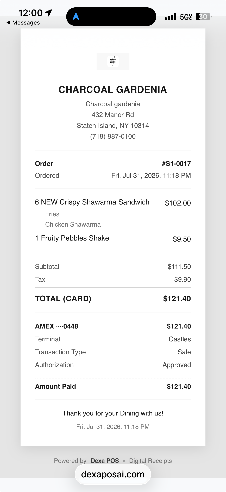

# Receipts — enlarge merchant logo + remove gray container background (check across all receipt types)

| Field | Value |
|---|---|
| Notion | https://app.notion.com/p/Receipts-enlarge-merchant-logo-remove-gray-container-background-check-across-all-receipt-types-3af8280c1b1d81338119d6cc74d64f9d |
| Page ID | `3af8280c-1b1d-8133-8119-d6cc74d64f9d` |
| Status | In progress |
| Priority | Low |
| Team | MERCHANT |
| Assignee | Ali Awdi |
| Start date | 2026-08-01 |
| Created / Last edited | 2026-08-01 · 2026-08-02 |

---

## Problem

On the digital receipt (SMS/email link → `dexaposai.com`), the merchant logo renders **too small** and **inside a visible gray rounded rectangle**. The gray container makes the logo look like a placeholder tile rather than branded artwork, and the small size wastes the header area.

The fix needs to be applied and **verified across every receipt type we render** — not just the digital web receipt. If the same container/sizing pattern is copy-pasted across templates, all variants need the same fix.

## Evidence

> iOS Safari, receipt link from SMS. Logo appears as a ~60px mark centered in a light-gray rounded rectangle above the "CHARCOAL GARDENIA" header. (Same screenshot also shows the `Terminal: Castles` line referenced by P2-18.)

## Current behavior

- Digital receipt (`dexaposai.com`): logo renders small (~60–70px) inside a gray rounded rectangle
- The container background is applied by the template regardless of the merchant's asset transparency
- Unclear whether the same styling is repeated on other receipt variants — must be audited

## Expected behavior

- Logo renders **larger** in the receipt header (target ~120px height, or 2× current, centered), aspect ratio preserved
- **No container background** — logo sits directly on the receipt's white/paper background. Transparency in the merchant's asset is preserved
- Consistent treatment across every receipt variant DEXA renders

## What ships

1. Fix the digital receipt template (`dexaposai.com`):
   - Remove gray container `background-color` (plus any `padding` / `border-radius` creating the tile look) from the logo wrapper
   - Increase logo max-height to ~120px (or Abubeckr's spec), `object-fit: contain`, centered
2. **Audit every receipt type** for the same issue and apply the same fix where needed:
   - Digital web receipt (`dexaposai.com`)
   - Email receipt template
   - SMS receipt (link body)
   - Printed thermal receipt (verify with Ali Dika if the printed rendering path is shared — printed logo is BMP/PNG via ESC/POS; no CSS container, but confirm the raster asset isn't being wrapped or padded before print)
   - Kitchen ticket header (if merchant logo is shown — usually not, but verify)
   - PDF export / re-download variant if one exists
3. Verify on iOS Safari, Android Chrome, and desktop for web-rendered variants
4. Screen recording of each receipt type before/after

## Acceptance criteria

1. Every receipt type that displays the merchant logo renders it with **no gray/colored container** behind it — logo sits directly on the receipt background
2. Logo size is ~2× current (target ~120px height for web variants, matching visual weight on thermal)
3. Aspect ratio preserved; logo remains centered
4. Web variants render correctly on iOS Safari, Android Chrome, and desktop
5. Full audit report attached to the ticket: list of every receipt type checked, screenshot of each after the fix
6. Screen recording delivered showing Charcoal's logo rendering correctly on all applicable variants

## Priority rationale

Low. Cosmetic on customer-facing receipts — does not block operation, but every paying customer sees it, and it's an easy brand-quality win. Ship in the next non-urgent release.

## Notes

- **Answer to Abubeckr's question:** the gray box is our template's container styling, not the merchant's uploaded asset. Fix is on our side across all templates.
- **Reference:** live receipt from order #S1-0017 at Charcoal Gardenia, Jul 31, 11:18 PM
- Related open ticket (same surface, same owner): **P2-18** — Remove "Terminal: Castles" line from customer receipts. Consider batching this fix into the same release.
