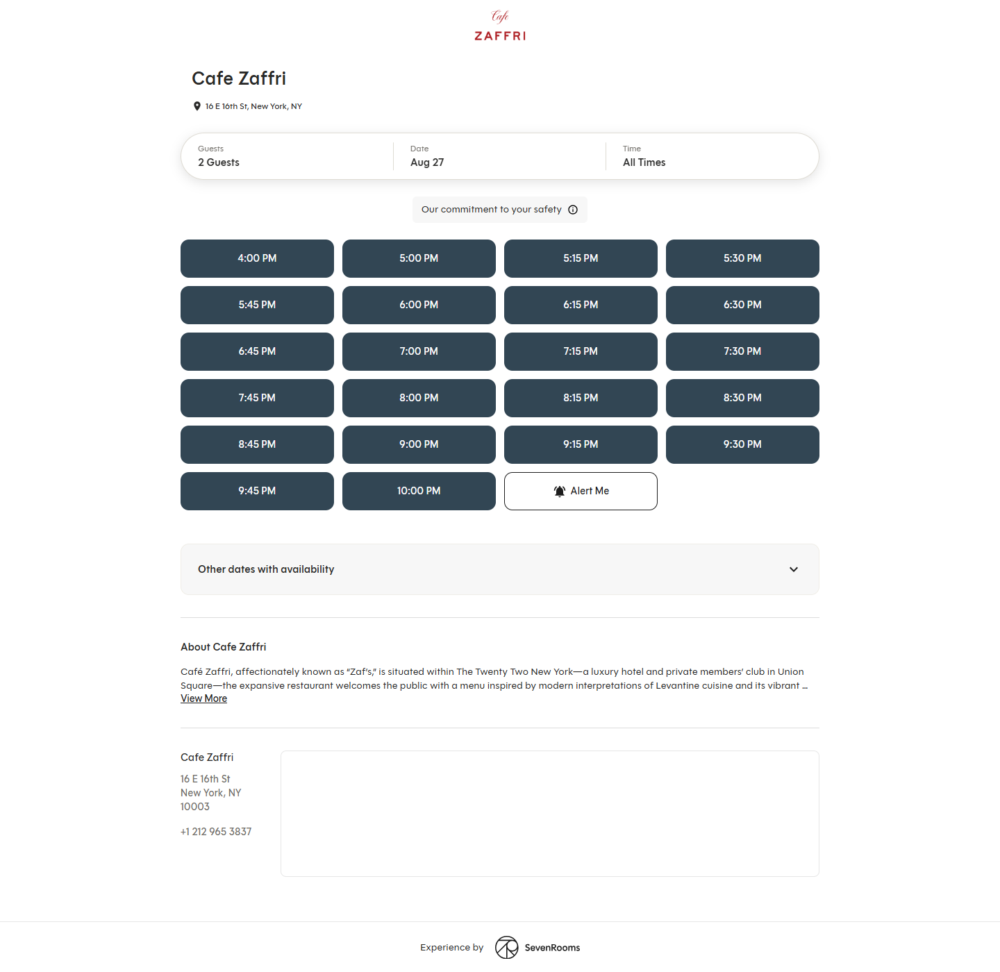
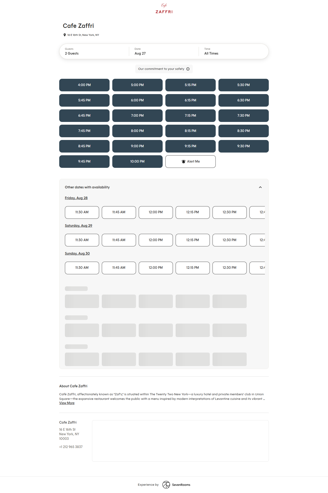
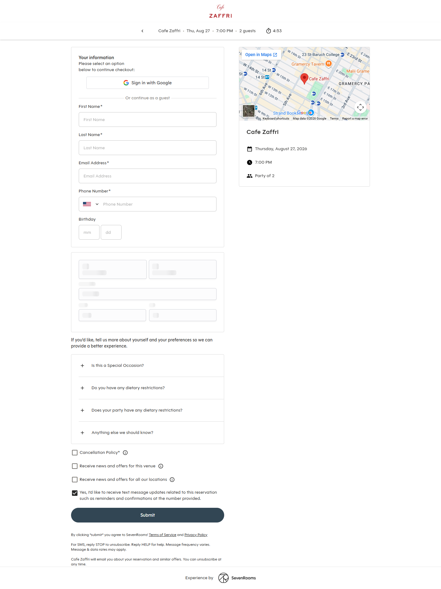
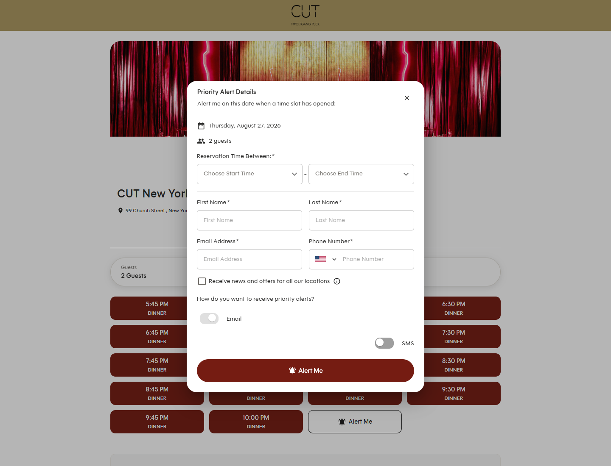
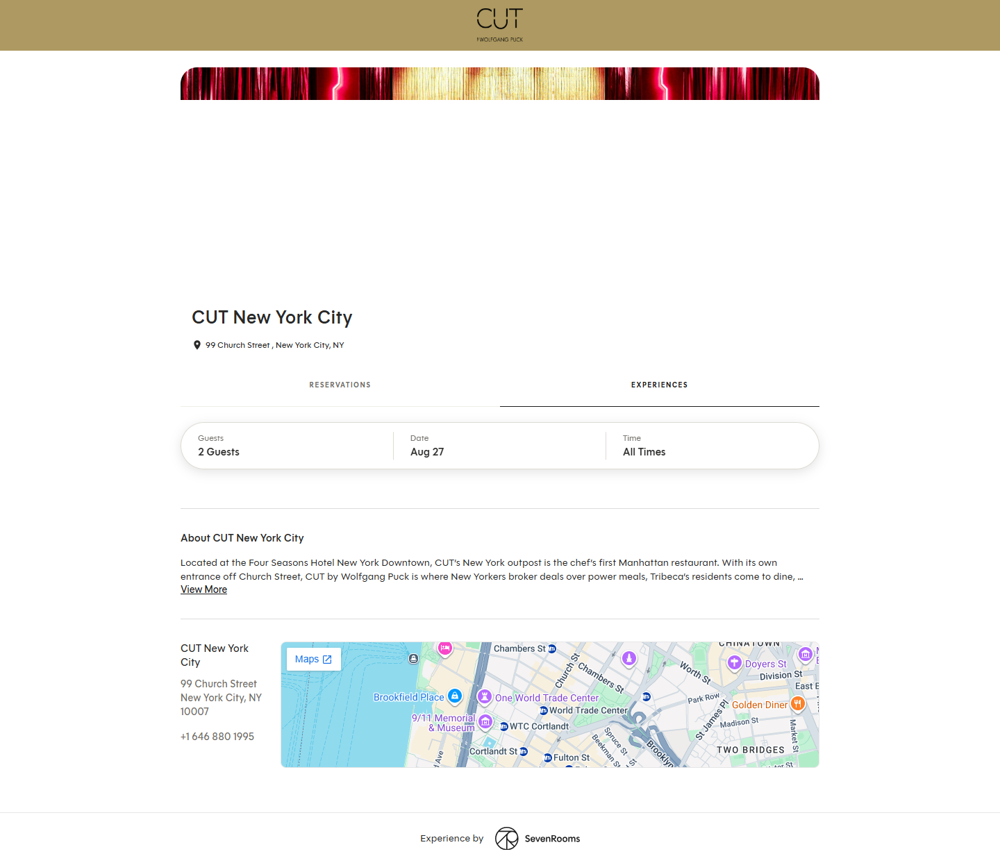
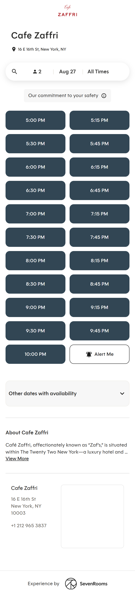
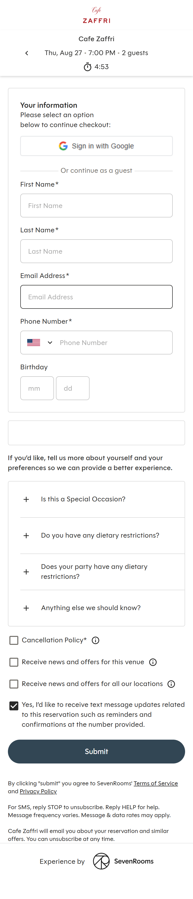

# SevenRooms reservation flow — UI/UX teardown

**Captured** 2026-08-27, headless Chrome at 1440×1100 and 390×844, from:

- `https://www.sevenrooms.com/explore/cafezaffri/reservations/create/search/` — Cafe Zaffri, plain single-service venue
- `https://www.sevenrooms.com/explore/cutnyc/reservations/create/search?searchTab=reservations` — CUT NYC, venue with an Experiences tab

Screenshots in [`shots/`](shots/); raw control dumps in `search-field-dump.txt` and `checkout-field-dump.txt`.
The flow was walked as far as the checkout form. **Nothing was submitted** — no real reservation was created.

---

## 1. The flow in one line

**Two screens. That's it.**

```
/reservations/create/search/                     →  /reservations/create/checkout/?date=…&party_size=…
[ guests · date · time ] → grid of time buttons      [ your info + preferences + consents ] → Submit
```

There is no "step 1 of 4" wizard, no separate confirm screen before submit, no account requirement. A guest goes from landing to booked in **two clicks and one form**. This is the single most important thing to copy.

---

## 2. Screen 1 — Search & availability



### Layout, top to bottom

| Band | Content |
|---|---|
| Venue chrome | Merchant logo only, centered. No SevenRooms branding at the top at all. |
| Identity | `Cafe Zaffri` (H1) + 📍 `16 E 16th St, New York, NY` as a small muted line |
| *(CUT only)* | Tab row: `RESERVATIONS` / `EXPERIENCES`, underline-style tabs |
| **Search bar** | One pill-shaped container, 3 segments split by hairline dividers |
| Notice | Optional pill: `Our commitment to your safety ⓘ` — merchant-authored |
| **Time grid** | 4 columns desktop, 2 columns mobile |
| Fallback | `Other dates with availability` — collapsed accordion |
| Content | `About <Venue>` + `View More` truncation |
| Contact | Address block + embedded Google map |
| Footer | `Experience by ◎ SevenRooms` — the *only* vendor mark, at the very bottom |

### The search bar

One rounded pill, three segments, each with a **small grey label above a large dark value**:

```
┌─────────────────┬──────────────┬───────────────┐
│ Guests          │ Date         │ Time          │
│ 2 Guests        │ Aug 27       │ All Times     │
└─────────────────┴──────────────┴───────────────┘
```

- Defaults are **2 Guests / today / All Times** — pre-filled so the grid is populated on first paint. No empty state, no "Search" button. Changing any segment re-queries immediately.
- The active segment lifts into a **white pill on a grey track** while its dropdown is open (see [03](shots/03-picker-guests.png)). Nice, cheap affordance.
- **Guests** → simple scrolling list, `1 Guest`, `2 Guests`, … current selection is a filled dark pill.
- **Date** → **two months side by side**, `‹ August 2026 | September 2026 ›`. Unavailable/past days are greyed but still rendered. Selected day is a filled circle. ([04](shots/04-picker-date.png))
- **Time** → list starting with `All Times`, then every 30 min from 6:00 AM. It's a *filter*, not the booking time. ([05](shots/05-picker-time.png))

### The time grid — the core of the design

- Every slot is a **large filled solid-colour button**, ~230×48px, generous 12px gaps. Not chips, not links, not a dropdown. They are the loudest thing on the page and the whole layout exists to serve them.
- The fill colour is **the merchant's brand colour** — Zaffri renders slate `#33444F`, CUT renders oxblood `#6B1A15`. Same component, themed per venue. Text is white, centered, semibold.
- Slots are `15` minutes apart within a service, and the grid simply reflows; there is no scroll, no "show more".
- **CUT adds a second line inside each button**: the service name, uppercase and smaller — `7:00 PM` / `DINNER`. That is how one grid covers Lunch + Dinner without a separate selector. `data-test="reservation-timeslot-button-7:00 PM-DINNER"` vs Zaffri's `…-7:00 PM`.
- **`Alert Me`** occupies the last cell of the grid — an *outlined* button in the same size and rhythm as the filled ones. It's not banished to a corner; it is presented as a peer of the times so the "nothing works for me" path is as visible as booking.

### `Other dates with availability`



Collapsed grey accordion below the grid. Expanded, it shows the **next three dates**, each as an underlined date heading (`Friday, Aug 28`) over a **horizontally scrolling row of outlined time chips**. Loads lazily with skeleton placeholders.

The visual hierarchy is deliberate: today's slots are **filled**, other-date slots are **outlined**. Same tap target, lower visual weight, so the guest is nudged to today but never dead-ended.

---

## 3. Screen 2 — Checkout



URL becomes `/reservations/create/checkout/?date=2026-08-27&party_size=2`.

### The sticky context bar — copy this exactly

```
‹   Cafe Zaffri  ·  Thu, Aug 27  ·  7:00 PM  ·  2 guests      ⏱ 4:53
```

- Pinned to the top for the whole form. The guest never has to remember or scroll back to check what they picked.
- `‹` returns to search **with the selection preserved**.
- **⏱ 4:53 is a live countdown.** The slot is *held* for 5 minutes while the guest fills the form; I watched it tick 4:53 → 4:50. This is the single best trust mechanism on the page — it says "this table is yours right now" and creates honest urgency without any dark-pattern copy.

### Two-column desktop, one-column mobile

Left = form. Right = a sticky summary card: Google map, venue name, then three icon rows — 📅 `Thursday, August 27, 2026` / 🕐 `7:00 PM` / 👥 `Party of 2`. Redundant with the top bar on purpose.

### The form

**`Your information`** — `Please select an option below to continue checkout:`

1. `Sign in with Google` (full-width outlined button)
2. `Or continue as a guest` (hairline divider with centered text)

Guest fields, stacked full-width, label above input, `*` marking required:

| Field | Type | Required | Notes |
|---|---|---|---|
| First Name | text | ✅ | |
| Last Name | text | ✅ | |
| Email Address | email | ✅ | |
| Phone Number | tel | ✅ | **country-flag selector** in a left segment |
| Birthday | `mm` + `dd` | ❌ | two tiny side-by-side boxes, **no year** |

`Birthday` with no year is a nice touch — enough for a birthday-marketing trigger, not enough to be a privacy ask.

**Preferences** — introduced with soft, opt-in copy:

> *If you'd like, tell us more about yourself and your preferences so we can provide a better experience.*

Four collapsed accordion rows with `+` / `−` affordances:

- `Is this a Special Occasion?`
- `Do you have any dietary restrictions?`
- `Does your party have any dietary restrictions?`
- `Anything else we should know?` → free textarea + a `SAVE` pill ([08](shots/08-checkout-accordion-open.png))

The first three are **tag pickers**, not free text — structured data the venue can actually act on. Everything optional is collapsed by default, so the form reads as five fields, not fifteen.

**Consents** — four checkboxes, each with an `ⓘ` info button:

| Checkbox | Default |
|---|---|
| `Cancellation Policy*` | ☐ unchecked, **required** |
| `Receive news and offers for this venue` | ☐ |
| `Receive news and offers for all our locations` | ☐ |
| `Yes, I'd like to receive text message updates related to this reservation such as reminders and confirmations at the number provided.` | ☑ **pre-checked** |

Note the split: *marketing* consent is off by default, *transactional SMS* is on by default. Correct, and worth mirroring.

**`Submit`** — one full-width filled pill in the venue's brand colour. Below it, small print: SevenRooms ToS/Privacy, `For SMS, reply STOP to unsubscribe…`, and `Cafe Zaffri will email you about your reservation and similar offers.`

---

## 4. Priority Alert (the waitlist-for-a-slot)



Clicking `Alert Me` opens a centered modal, not a page:

> **Priority Alert Details**
> Alert me on this date when a time slot has opened:
> 📅 Thursday, August 27, 2026  👥 2 guests

- `Reservation Time Between:*` — two selects, `Choose Start Time` – `Choose End Time`
- First / Last Name, Email, Phone — **two-column** here, unlike checkout
- `Receive news and offers for all our locations` checkbox
- `How do you want to receive priority alerts?` → two **toggles**: `Email`, `SMS`
- Filled `🔔 Alert Me` submit in brand colour

This turns a dead end into a captured lead with a phone number. It is the highest-ROI secondary feature on the page.

---

## 5. Experiences tab (CUT)



Same search bar, different inventory — ticketed/prix-fixe offerings instead of open tables. Empty for this venue/date and it degrades gracefully: the tab renders, the search bar renders, the grid area is simply absent with no error. **Not needed for v1** — note it as the extension point for ticketed events.

---

## 6. Mobile

| Search | Checkout |
|---|---|
|  |  |

- Search bar collapses to a **single pill with a 🔍 icon**: `🔍 | 👤 2 | Aug 27 | All Times`. Icons replace the stacked labels; the three segments survive.
- Time grid → **2 columns**, buttons stay full-height. Nothing shrinks to a chip.
- Checkout → single column, the summary card moves below the form, and the context bar **wraps to two lines** with the timer on its own centered row.

---

## 7. What to take, ranked

### Must have
1. **Two screens, no wizard.** Search → checkout → done.
2. **Pre-filled defaults (2 guests / today / all times) and results on first paint.** No search button.
3. **Big solid time buttons in a grid, brand-coloured.** The grid *is* the page.
4. **The 5-minute hold + visible countdown** in a sticky context bar. Requires a real hold on the server, not just a UI timer.
5. **Guest checkout with 4 required fields.** Never force an account.
6. **Sticky `venue · date · time · party` bar** with a back arrow that preserves state.
7. **Collapsed optional preferences.** The form must *look* short.
8. **Marketing consent off, transactional SMS on.**

### Should have
9. `Alert Me` as a peer cell in the grid + the Priority Alert modal.
10. `Other dates with availability` — never dead-end on a full night.
11. Two-month date picker.
12. Service label (`DINNER`) as a second line inside the slot button when a day has multiple services.

### Skip for v1
13. Google sign-in, Experiences tab, birthday capture, the embedded map.

---

## 8. How this maps onto DexaPOS

Our `public.reservations` table already covers most of what this flow collects.

| SevenRooms field | Our column |
|---|---|
| First + Last Name | `party_name` |
| Email Address | `email` |
| Phone Number | `phone` |
| Guests | `party_size` |
| Date | `reservation_date` |
| Time slot | `reservation_time` |
| Confirmation | `confirmation_number` |
| `Anything else we should know?` | `special_requests` |
| Special occasion / dietary tags | *(no column — needs `notes` or a new jsonb)* |
| Booked from the website | `source` (add `'website'`) |

`status` should land as `pending`, and the existing `notify-reservation-guest` edge function + `reservation.created` template already exist to send the confirmation SMS. `duration_minutes` (default 90) plus `lib/reservations/conflict-detection.ts` is what a slot-availability query has to respect.

### The three real gaps

1. **Availability generation.** We have no concept of service hours, slot interval, or per-slot capacity. Something has to turn "the venue is open 5–10 PM, 15-min slots, N covers" into the grid. This is the biggest piece of net-new work, and it is the one the whole design rests on.
2. **The hold.** The 5-minute countdown needs a server-side hold so two guests can't take the same cover. There is no hold concept in the schema today.
3. **The public write path.** [`lib/site-builder/sections/kinds.ts:15-16`](../../../lib/site-builder/sections/kinds.ts#L15-L16) already names this as the blocker for the `reservations` section kind: *"needs a public write path into the existing reservations table."* `public.reservations` has one RLS policy — `"Admin Write"` — so an anon visitor on `/sites/{slug}` cannot insert. This needs an anon-callable security-definer RPC with rate limiting, the way `waitlist_sms_rate_limit` guards the walk-in path.

Today the builder only supports an **outbound link** — `SITE_FEATURES.reservations` + `brand.reservationUrl` puts a "Book a table" button in the header ([`HeaderSection.tsx:26`](../../../components/site-builder/sections/HeaderSection.tsx#L26)). A native section replaces that link with the flow above.
